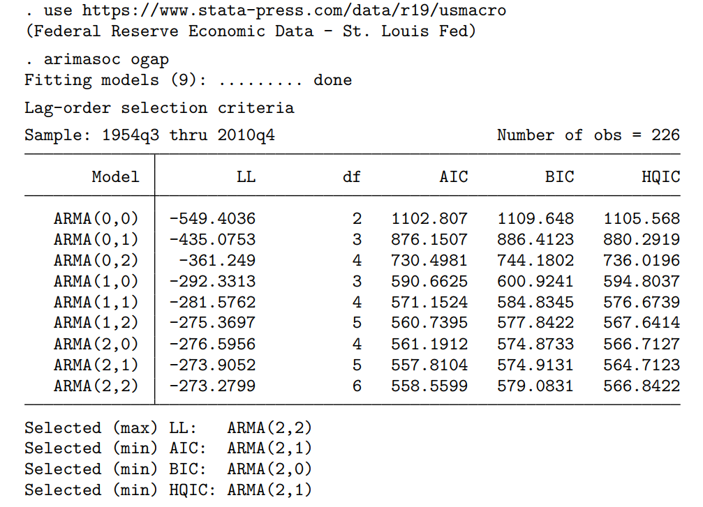
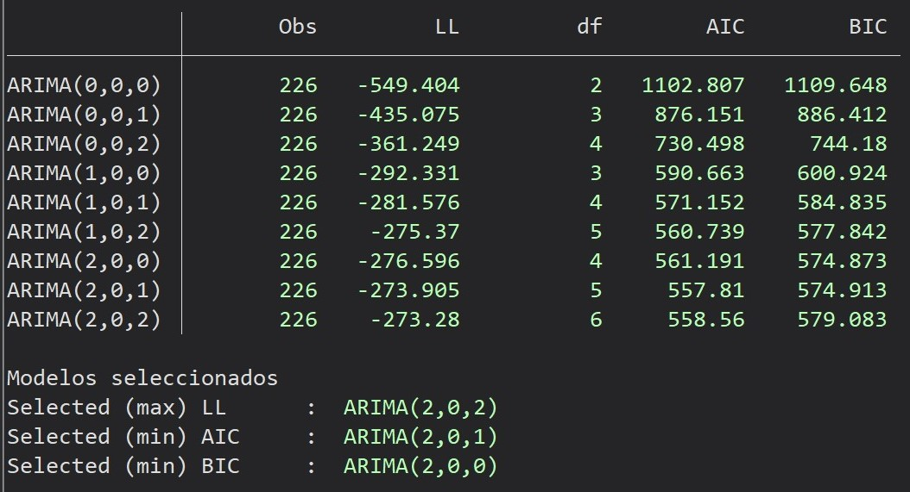

<!-- [](https://doi.org/10.5281/zenodo.15029905) -->

<br />
<div align="center">
  <a href="https://github.com/JelsinPalomino/SiSedeInversiones">
    
  </a>

<h3 align="center">ARIMASELECT</h3>

  <p align="center">
    Este comando es una alternativa al comando (arimasoc) para versiones de STATA donde no se puedan instalarse.
    <br />
  </p>
</div>


arimaselect
=========================

Actualizado al 25/11/2025

Este comando de STATA se desarrolla para apoyar en la selección del mejor modelo ARMA para series de tiempo. Asimismo, se desarrollo como una alternativa al comando **arimasoc**, puesto que no se logro ubicar este comando para la versión 16 de STATA al tratar de instalarlo con _**ssc install arimasoc**_ y tampoco se logro ubicar el archivo **.ado** del comando. 

Por lo tanto, el objetivo de este comando es contar con una alternativa viable y que presente los mismos resultados que se podrían obtener por **arimasoc**.

<!-- > **Ficha técnica**: [Consulta aquí](https://proyectos.inei.gob.pe/iinei/srienaho/Descarga/FichaTecnica/498-Ficha.pdf) -->

Contenido
---------

- [I. Instalación](#i-instalación)
- [II. Descripción del Comando](#ii-descripción-del-comando)
- [III. Ejemplos Prácticos](#iii-ejemplos-prácticos)
- [IV. Cómo Citar este Repositorio](#iv-cómo-citar-este-repositorio)
- [Licencia](#licencia)

I. Instalación
--------------
Ejecute el siguiente codigo en el programa STATA.

```stata
*Install arimaselect (remove program if it existed previously)
. cap ado uninstall arimaselect 
. net install arimaselect, from(https://github.com/JelsinPalomino/arimaselect/raw/main/src/)
```
**Advertencia importante:** Para que este comando funcione se debe haber aplicado el comando _tsset_ para el análisis de series de tiempo.

II. Descripción del comando
---------------------------

El comando principal es _arimaselect_. Su **sintaxis** es:

```stata
. arimaselect depvar, maxar(#p) maxma(#q)
```

### Parámetros:

*   **maxar**: autoregressive terms of the structural model disturbance. El valor por defecto es 1.
    
*   **maxma**: moving-average terms of the structural model disturbance. El valor por defecto es 1.    

III. Ejemplo práctico
---------------------

### 1) Usaremos los datos macroeconómicos de EEUU para ajustar varios modelos ARMA de la brecha de producción (ogap)

Para este ejemplo vamos a usar el mismo ejemplo que se encuentra en la documentación del comando **arimasoc** para comparar si los resultados son los mismos:

El ejemplo que se encuentra en la documentación es el siguiente:



El código que usa el comando propuesto **arimaselect** se realiza de la siguiente manera:

**Instalamos el comando**: si no lo tenemos

```stata
. cap ado uninstall arimaselect 
. net install arimaselect, from(https://github.com/JelsinPalomino/arimaselect/raw/main/src/)
```

**Leemos los datos a análizar**:

```stata
. use https://www.stata-press.com/data/r19/usmacro
```
Una vez instalado, seguimos con el siguiente paso.

**Aplicamos el comando _arimaselect_**:

```stata
. arimaselect ogap, maxar(2) maxma(2)
```

**Los resultados son los siguientes**:




### Notas

Los datos mostrados para ambas figuras son las mismas, tanto los obtenidos por el comando **arimasoc** y **arimaselect** usando el mismo dataset para ambos casos.

## 5). Cómo citar este repositorio

Si utilizas **ARIMASELECT** en tu investigación o trabajo académico, por favor considera citar este repositorio de la siguiente manera:

Jelsin Palomino. (2025). *JelsinPalomino/arimaselect: Estadísticas para seleccionar un modelo ARMA (v0.0.1)*

Licencia
--------

Este repositorio está autorizado bajo la **licencia MIT**. Ver <a href="./LICENSE">LICENCIA</a> para más detalles.


